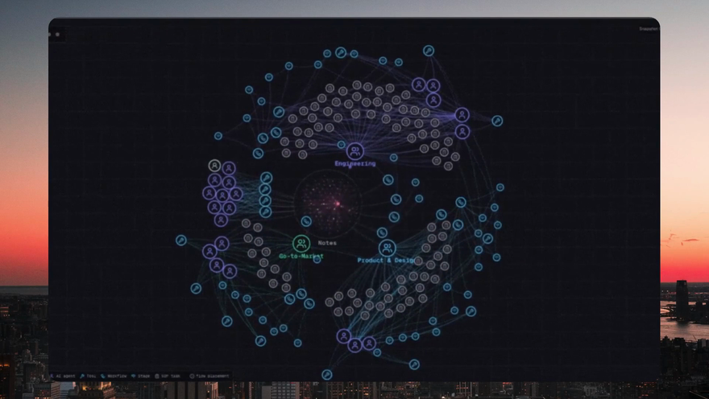

<p align="center">
  <picture>
    <source srcset="gitbooks/.gitbook/assets/opencompany-hero.gif" type="image/gif" />
    
  </picture>
</p>

<h1 align="center">OpenCompany</h1>

<p align="center">
  <strong>Run an entire company with a headcount of one.</strong>
</p>

<p align="center">
  OpenCompany is the operating layer for one-person businesses powered by
  agents. You bring the vision and the judgment calls. Your agents do the work:
  every function, around the clock, at the speed of software.
</p>

<p align="center">
  <a href="https://github.com/tinyhumansai/opencompany/blob/main/LICENSE"></a>
  <a href="https://github.com/tinyhumansai/opencompany/stargazers"></a>
  <a href="https://github.com/tinyhumansai/opencompany/issues?q=is%3Aissue+is%3Aopen+label%3A%22good+first+issue%22"></a>
  <a href="https://github.com/tinyhumansai/opencompany/commits/main"></a>
  
</p>

<p align="center">
  <a href="https://tinyhumans.ai/opencompany"></a>
  <a href="https://discord.tinyhumans.ai"></a>
  <a href="https://x.com/tinyhumansai"></a>
  <a href="https://www.reddit.com/r/tinyhumansai/"></a>
</p>

> [!WARNING]
> **🚧 Work in progress.** OpenCompany is under active development and moving
> fast. APIs, the CLI, the example harnesses, and the docs will change without
> notice. Explore it, fork it, build on it, but don't depend on anything
> staying put yet. Not production-ready.

---

## The company of one

For a century, ambition meant headcount. Want to ship a product? Hire engineers.
Want customers? Hire marketers, then sales, then support. Every new capability
was a new payroll line, a new manager, a new quarter of ramp-up.

That tax is gone. OpenCompany turns a single operator into a full org chart.
Scouts, founders, engineers, designers, marketers, lawyers, finance, support and
recruiters, all instantiated as agents, coordinated by one host, working while
you sleep. You stay where humans are irreplaceable: **capital, taste, and the
decisions that actually matter.** Everything else is delegated.

This isn't a chatbot with a to-do list. It's a **company runtime**: a durable
host that stands up a roster of specialized agents, gives each one a clear
mandate, and runs them as a coordinated business on top of the OpenHuman and
TinyHumans runtimes.

## What one person can now run

Every folder under [`companies/`](companies/) is a complete company you can
launch today, with a roster of agents, their responsibilities, and the handful
of moments where a human signs off:

| You want to run a… | Your agents handle | You keep |
| --- | --- | --- |
| **[Venture Studio](companies/agentic_venture_studio/)** | Scouting, founding, building, launching, operating a portfolio | Capital allocation & strategy |
| **[Startup Accelerator](companies/startup_accelerator/)** | Sourcing, screening, mentoring, demo day, investor intros | Investment decisions |
| **[VC Firm](companies/agentic_venture_capital/)** | Deal flow, diligence, memos, portfolio support | The final "yes" |
| **[Consulting Firm](companies/agentic_consultation_firm/)** | Research, analysis, modeling, decks, implementation plans | Executive workshops |
| **[Software Company](companies/agentic_software_company/)** | PM, design, frontend, backend, QA, security, docs, support, DevRel | Product direction |
| **[Product Team](companies/agentic_product_team/)** | A triaged queue, a groomed backlog, a defended roadmap | Prioritization calls & roadmap sign-off |
| **[Marketing Agency](companies/agentic_marketing_agency/)** | Creative, copy, SEO, paid, email, landing pages, analytics | Campaign sign-off |
| **[Design Studio](companies/agentic_design_studio/)** | Branding, UI, motion, illustration, user testing | Creative direction |
| **[Media Company](companies/agentic_media_company/)** | Finding, verifying, writing, illustrating, distributing stories | Editorial standards |
| **[Influencer Brand](companies/agentic_influencer_business/)** | Scripting, editing, thumbnails, posting, community, sponsorships | Your face (or an avatar) |
| **[Game Studio](companies/agentic_game_studio/)** | Worlds, story, code, art, QA, balance, launch | Creative direction |
| **[Game Business](companies/agentic_game_business/)** | UA, monetization, LiveOps, community, store optimization | Growth strategy |
| **[Recruiting Firm](companies/agentic_recruiting_company/)** | Sourcing, outreach, screening, interviews, offers | Final hiring calls |
| **[Enterprise Sales](companies/agentic_enterprise_sales/)** | Lead gen, outreach, CRM, proposals, contracts, follow-up | Closing strategic accounts |
| **[Support Org](companies/agentic_customer_support/)** | Tickets, docs, bug reports, escalations, refunds | Policy & escalation |
| **[Real Estate Co](companies/agentic_realestate_company/)** | Sourcing, analysis, underwriting, contractors, tenants | Purchase approvals |
| **[Accounting Firm](companies/agentic_accounting_firm/)** | Bookkeeping, tax, payroll, forecasting, audit prep | Signing the filings |
| **[Law Firm](companies/agentic_law_firm/)** | Research, drafting, litigation support, discovery, compliance | Approving filings |
| **[Pharma Startup](companies/agentic_pharma_startup/)** | Literature, molecule discovery, simulation, trial planning | The lab work |
| **[Research Lab](companies/agentic_research_lab/)** | Source-backed research reports with the evidence attached | Setting the question & accepting findings |
| **[Math Lab](companies/agentic_math_lab/)** | Verified answers to computational problems, with the programs that produced them | Stating the problem & accepting the answer |
| **[Signals + Opportunity Studio](companies/signals_opportunity_studio/)** | Scouting signals, clustering pains, ranking opportunities into a weekly brief | Which opportunities to fund |

Twenty-two companies. One operator. Pick one and run it, or run several at once.
[`companies/README.md`](companies/README.md) has the full catalog.

## Quickstart

You do not need a software background to run a company. You need
[Docker Desktop](https://www.docker.com/products/docker-desktop/), a terminal,
and about fifteen minutes. On Windows the terminal must be POSIX —
[WSL](https://learn.microsoft.com/windows/wsl/install) or Git Bash — because the
quickstart below uses `export` and `./scripts/launch-demo.sh`.

```sh
git clone --recurse-submodules https://github.com/tinyhumansai/opencompany.git
cd opencompany
export TINYHUMANS_API_KEY="th-..."          # grab yours at tinyhumans.ai
export OPENCOMPANY_FEATURES="medulla"       # compile in the hosted Medulla brain the key unlocks
./scripts/launch-demo.sh marketing up
```

The first run takes a few minutes while it downloads and builds. When it
settles, open **<http://localhost:5173>**. That's the console, where you watch
your agents work and answer anything waiting on you.
`./scripts/list-demos.sh` lists the other businesses you can launch in place of
`marketing`, and `./scripts/launch-demo.sh marketing down` shuts it all down.

Prefer to build the host from source, deploy it somewhere, or change the runtime
itself? That path lives in [docs/running-locally.md](docs/running-locally.md):
Cargo builds, Compose, feature flags, the Tauri desktop preview, and
DigitalOcean / AWS deploys.

> **You'll want a TinyHumans API key.** It's what unlocks Medulla and lets the
> agents think and act. Without one you can still launch a company and look
> around; the agents just won't do real work. Grab a key at
> **[tinyhumans.ai](https://tinyhumans.ai)** and
> `export TINYHUMANS_API_KEY="th-..."`.

## Why it works

- **A real org chart, not a prompt.** Each company is declared as a roster of
  agents with distinct mandates in a simple `company.toml`. The host
  instantiates them, coordinates them, and keeps them running.
- **Humans in the loop where it counts.** Every harness names the exact
  decisions reserved for you. Delegate the work; keep the judgment.
- **Built on proven runtimes.** OpenCompany is a light host over OpenHuman and
  the TinyHumans agent modules, so it reuses their runtime instead of
  reinventing it.
- **Rust-fast and inspectable.** An Axum HTTP surface, a small default build,
  and deeper capabilities behind feature flags. Simple to start, honest to
  operate, easy to test.
- **Yours to own.** GPL-3.0, self-hostable, no lock-in.

## The engine: Medulla

A company of one only works if something can hold the whole company in its head.
That something is **Medulla**, TinyHumans' orchestrator model, purpose-built to
run large fleets of agents as a single coordinated business.

Medulla is orchestrator-first. Every event, whether a customer email, a market
signal or a finished task, lands on a deep orchestration tier that reads the full
picture, decides what matters, and fans the work out across your agents. As your
company grows from nine agents to nine hundred, Medulla is what keeps it
coherent, on-strategy, and moving without you in every message. It's a hosted
model: you reach it with a TinyHumans API key, and OpenCompany is the open host
that points your companies at it.

## Make it yours

Each company folder holds a `company.toml`, a plain text file naming the roles,
what each one owns, and where you want to be asked before anything happens. It's
written to be read by people; changing a role is editing a few lines rather than
programming. `opencompany check` reports any problems in plain language, and
adding a new business is a new folder, not a new program.
[Your first company](gitbooks/get-started/your-first-company.md) walks through it.

## Documentation

| Where | What's there |
| --- | --- |
| [`gitbooks/`](gitbooks/README.md) | The full docs: what OpenCompany is, what one person can run, how [Medulla](gitbooks/overview/medulla.md) drives it |
| [`docs/running-locally.md`](docs/running-locally.md) | Docker, Compose, from-source builds, feature flags, desktop preview, deploy targets |
| [`docs/repository-layout.md`](docs/repository-layout.md) | Where everything lives in the tree and what each package owns |
| [`docs/spec/README.md`](docs/spec/README.md) | Architecture reference |
| [`gitbooks/developers/`](gitbooks/developers/README.md) | Build, CLI, authoring companies, deployment, configuration |
| [`qa/`](qa/README.md) | Checking a release against a deployed tenant |

## Contributing

New here? Start with the
[good first issues](https://github.com/tinyhumansai/opencompany/issues?q=is%3Aissue+is%3Aopen+label%3A%22good+first+issue%22),
which are scoped to be finishable in a sitting.
[CONTRIBUTING.md](CONTRIBUTING.md) has the local checks to run before opening a
pull request, and anything big enough to break an existing company starts as an
[RFC](https://github.com/tinyhumansai/opencompany/discussions/categories/rfcs)
rather than a PR.

## Community

[Discussions](https://github.com/tinyhumansai/opencompany/discussions) is where
questions get answered and large changes get argued out before they're built.
[SUPPORT.md](SUPPORT.md) says which channel takes what.

- **Discord**: <https://discord.tinyhumans.ai>
- **X**: [@tinyhumansai](https://x.com/tinyhumansai)
- **Reddit**: [r/tinyhumansai](https://www.reddit.com/r/tinyhumansai/)
- **Website**: [tinyhumans.ai/opencompany](https://tinyhumans.ai/opencompany)

## License

OpenCompany is licensed under the GNU General Public License v3. See
[LICENSE](LICENSE).
